# Final PJT

> SSAFY 11기 1학기 관통 프로젝트

<div align="center">

## 🛠 Tech Track 🛠

<span style="color:black; background-color:#fff5b1; font-family:bold; font-size:20px;" >Front End </span>  


<span style="color:white; background-color:#008000; font-family:bold; font-size:20px" >Back End </span>  


</div>

# 🌃 프로젝트 개요

:star: **프로젝트 이름** : Finance Navigator  
:clock1: **프로젝트 기간** : 2024.5.16 ~ 2024.5.23 (2024.5.24 발표)  
:department_store: **팀원** : 강동완, 김경대, 윤민재

## 📘 의도 및 방향

사용자가 예적금 및 대출에 대한 정보를 한번에 보기 쉽고 간단한 정보들을 확인  
이에 대한 논할 수 있는 게시글을 작성하는 공간을 마련  

그리고 사용자들이 이용하는 많은 상품들을 보여주는 간단한 추천 시스템을 보여줌으로써  
어느 상품이 이용을 많이 하는지를 확인이 가능  


## 🔨 팀 역할 및 구현

|이름|역할|구현기능|
|:------|:---|---|
|강동완|팀장|1. 타 금융사이트 분석 <br> 2. 금융상품리스트 DB저장 + 백 - 프론트 연결 + 상품간 비교기능구현  <br> 3. 메인 HomeView 및 각 프론트 작성 <br> 4. 구독시 이메일 발송기능 구현 <br> 5. 추천 알고리즘 보완 - 연령대별 인기상품 |
|김경대|팀원|1. User모델 커스텀 - email과 비밀번호로 로그인 + 추가 필요한 필드<br> 2. 게시글 및 댓글에 대한 모델 구현 & 관련 DRF(Serializer, urls, views) 구현 + Vue로 해당 페이지를 구현 <br> 3. 프로필 뷰 및 프로필 수정 - 관련 serializer 및 views 설정 + Vue3 페이지 구현 <br> 4. 기타 CSS & Vue Transition 이용한 간단한 애니메이션 추가. <br> 5. 카카오맵 (지도 은행) 관련 일부 수정  |
|윤민재|팀원|1. 은행 검색 - KaKao Map API 및 select-option 활용한 검색을 통한 지도 구현 <br> 2. 환율 계산기 - 하나은행 API 및 select-option 활용한 검색을 통한 환율 계산 구현 <br> 3. 상세페이지 구현 - Naver API를 활용해 관련 이미지 로딩 구현 <br> 4. chart.js-기본 금리 / 우대 금리 - 기본 금리 기반 스캐터 그래프 생성 <br>  5. chat gpt api 활용 챗봇 - 프롬포트 선입력을 통해 경제, 경영, 금융 주제에 맞는 답변 유도|


## 🗃 DataBase 설계 (ERD)

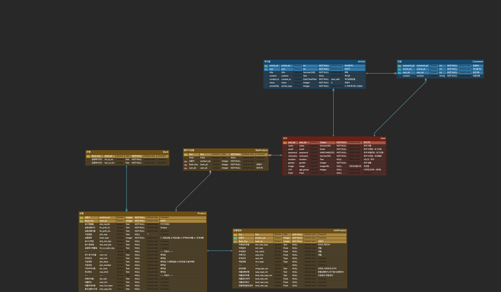 


# 🎇 기능  

## ⛺ HomeView

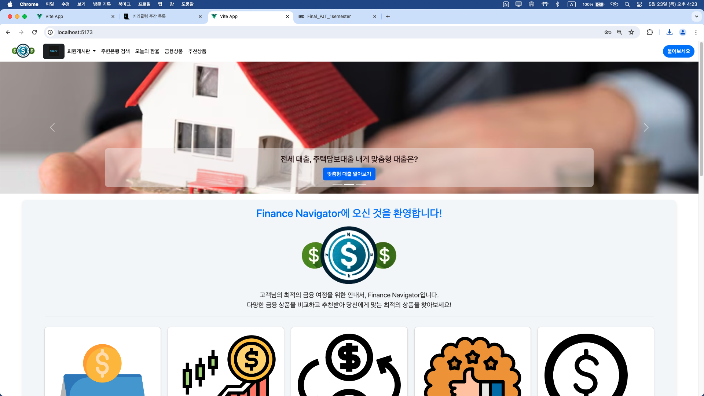
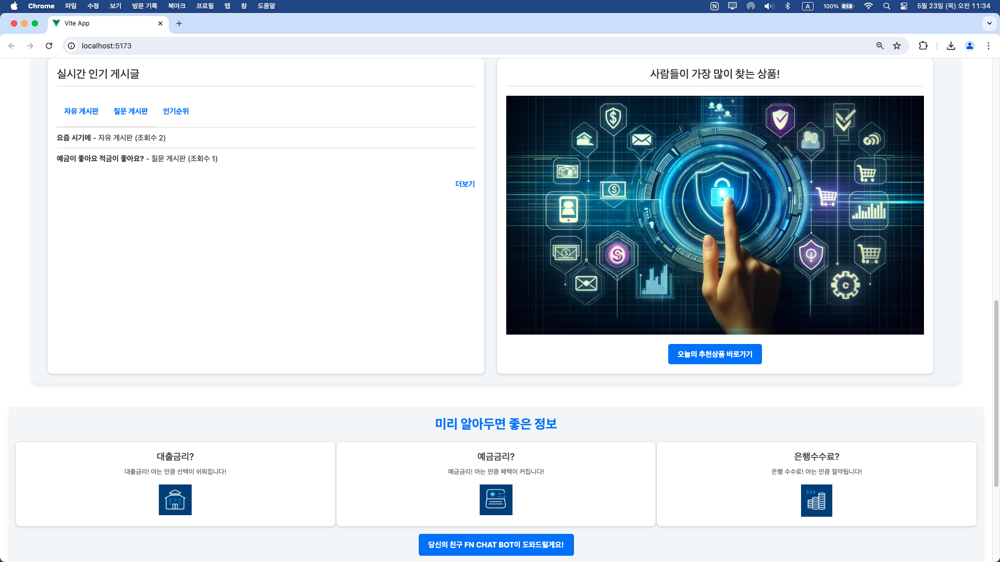

## 🙆‍♂️ User  

### 로그인 & 회원가입  

단순한 form 디자인 보다는 현대식으로 하기 위해 loginForm Open source를 이용 

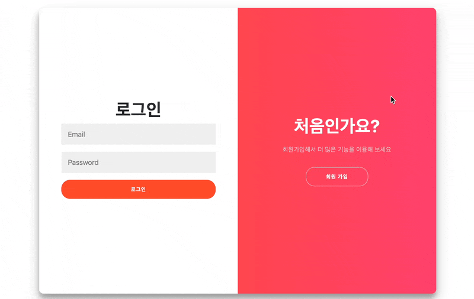

프로필 하단에 가입한 상품 목록을 출력  

- - -

### 프로필 뷰 및 프로필 수정   

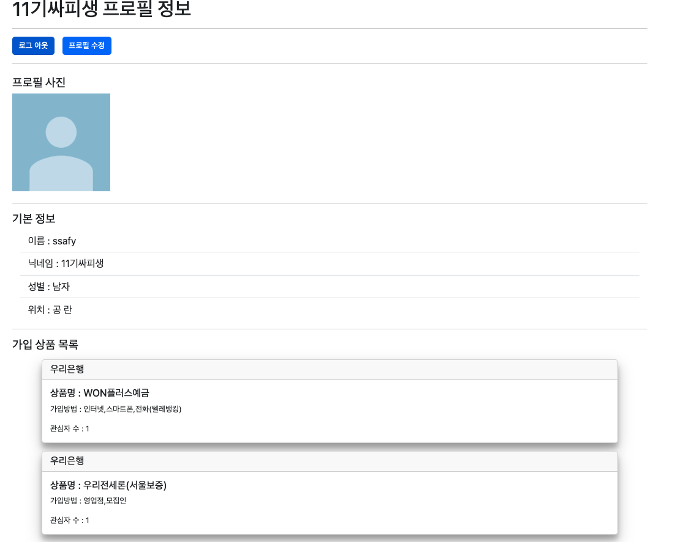
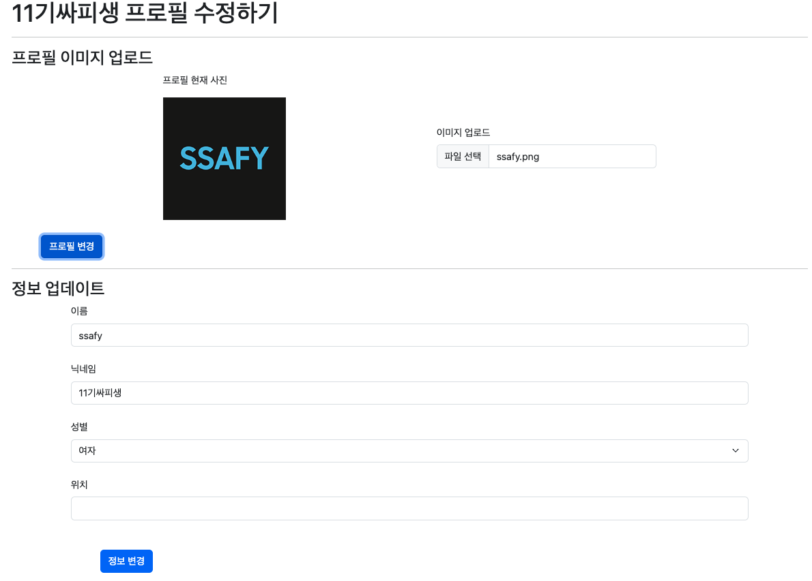


## :clipboard: 게시글

### 게시글 목록 
 
 게시글 목록들 어떤 게시글이냐에 따라서 다른 게시글들 보여주도록 설정
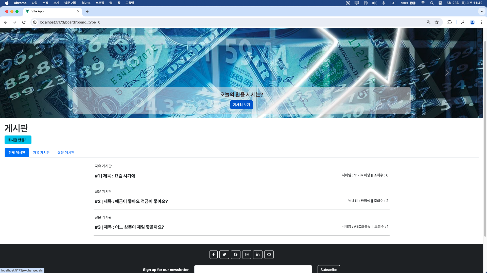


 게시글 상세 글. 여기서 덧글 등을 작성이 가능  
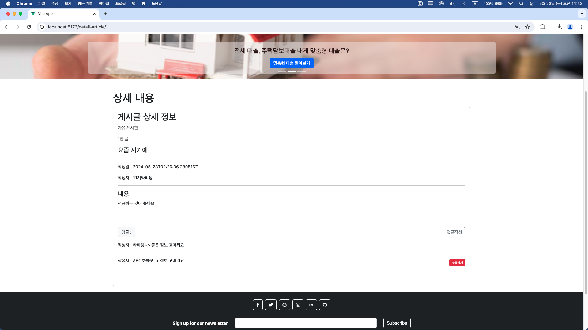

 계정이 해당 게시글이랑 동일 인물인 경우 수정 및 삭제 버튼 추가 (덧글도 유사 )
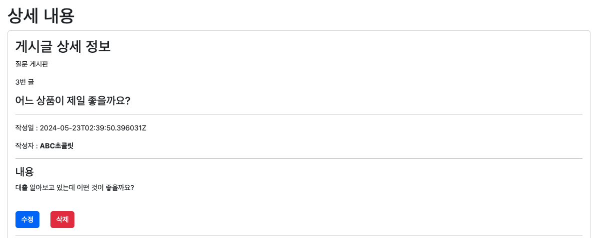


## 🏦 주소 검색 -> 은행 검색  
주소 및 은행 입력시 해당 주소와 해당 은행의 위치 리스트 출력  
마커를 클릭하면 해당하는 블럭로 자동으로 이동 및 강조 표시   
각각의 검색 결과 블럭을 클릭하면 해당 지도 검색 결과 표시  


## 💲 환율 계산기  
[하나은행 환율정보조회](https://hanafnapimarket.com/#/apis/detail?apiId=hbk00004)API를 이용.  

이를 통해 실시간으로 백엔드의 처리 필요 없이 환율 조회 가능 

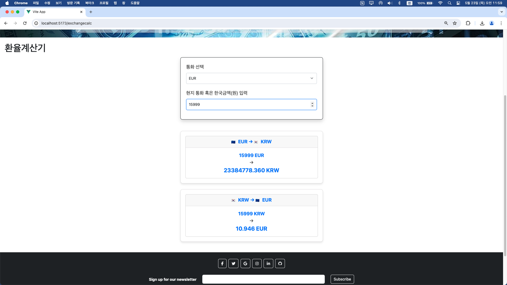

## :high_brightness: 금융 상품 목록  
기본적인 사용법  
  

일부 항목에 대한 오름차순/내림차순 기능 제공  
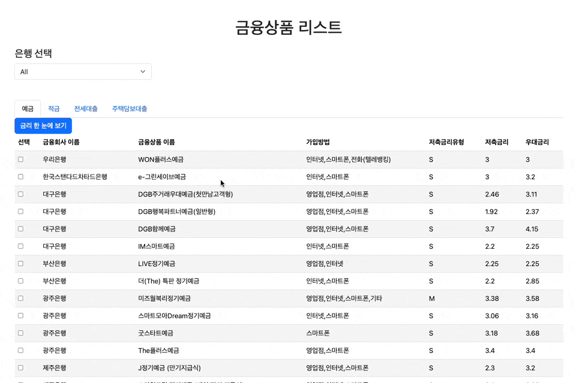  

상품들에 대한 몇가기 클릭 후 표로 비교 가능
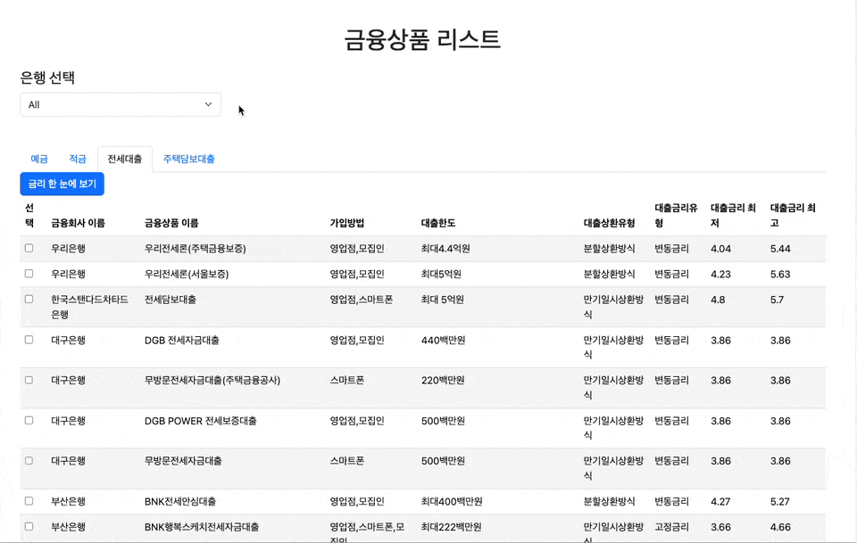

전체적인 상품에 대한 간단한 그래프 - Chart.js를 활용
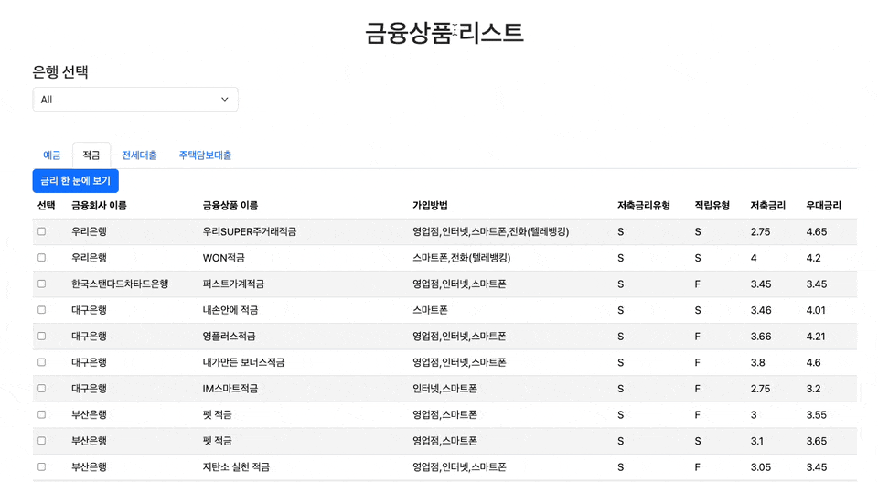


## :high_brightness: 금융 상세 정보  
클릭하면 특정 상품에 대한 정보와 가입하기 버튼을 구현  
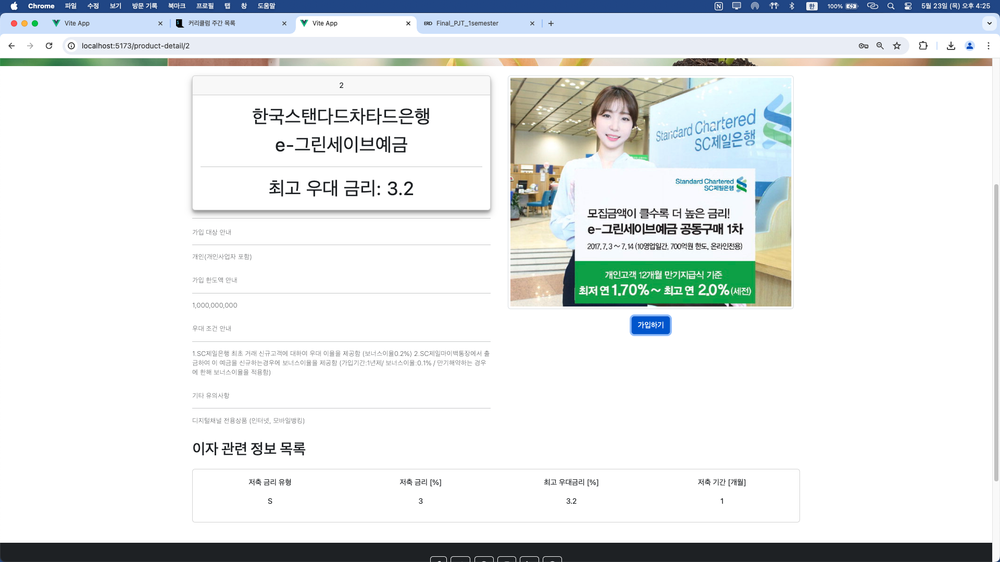

또한 가입하기 버튼구현을 Vue의 pinia local-storage를 통해 
**새로고침 없이** 동작하도록 구현  


## :factory: 금융 추천 정보 

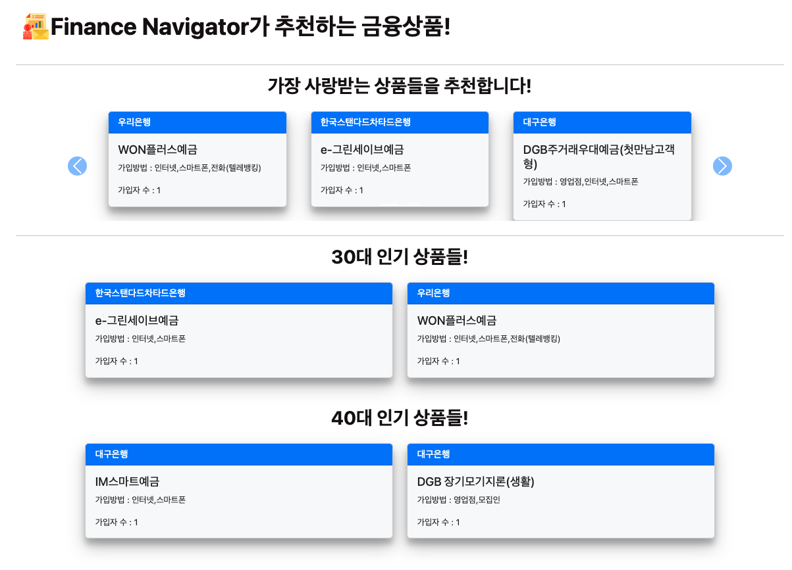  
기본적으로 "가입자 많은 순서" 대로 내림차순으로 하되  

아래 부분은 **나이**별로 세분화하여서 표시를 하고  
위 부분은 종합적으로 나이와 상관없이 종합 가입자 수가 많은 순서대로 상품을 추천  
최대 6개의 상품에 대해서만 출력  

## :computer: AI - ChatGPT
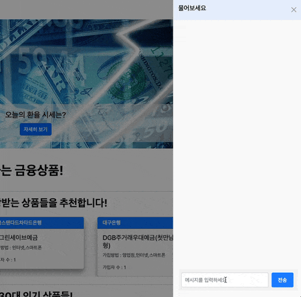  
 
약간의 프롬프트를 미리 기입하고 난 다음 사용자에게 챗봇을 제공하는 형태  

다음은 전달되어지는 프롬프트 코드 부분

```javascript
  const body = {
    model: "gpt-4",
    messages: [
      {
        role: "system",
        content: `
          당신은 경제, 경영, 금융 분야의 전문가 챗봇입니다. 다음 사항을 유념해 주세요:
          1. 사용자가 묻는 질문에서 경제, 경영, 금융 관련 주제를 우선적으로 다뤄 주세요.
          2. 사용자가 질문에 포함한 단어를 분석하여 관련된 경제, 경영, 금융 정보를 제공하세요.
          3. 질문이 모호할 경우, 추가 정보를 요청하여 명확히 이해하려고 노력하세요.
          4. 항상 정확하고 구체적인 정보를 제공하세요.
        `,
      },
      {
        role: "user",
        content: prompt,
      },
    ],
  }
```

## 뉴스레터 기능 (이메일 전달)
입력란 
  

실제 이메일 전달되는 내용
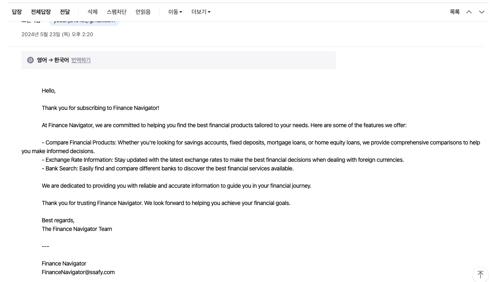

Django가 지원하는 core mail smtp를 활용해
google에서 제공하는 smtp기능으로 
footer의 이메일 입력폼을 통해 해당 이메일로 구독기능 제공
- 추후 정기적인 금융상품 정보 제공가능

```python
#settings에 필요한 Parameter

EMAIL_BACKEND = 'django.core.mail.backends.smtp.EmailBackend'
EMAIL_HOST = 'smtp.gmail.com'
EMAIL_PORT = 587
EMAIL_USE_TLS = True
EMAIL_HOST_USER = '주체 이메일'
EMAIL_HOST_PASSWORD = EMAIL_PASSWORD


#실제 메시지를 전달하기 위한 코드 작성 (views.py)
@api_view(['POST'])
def subscribe(request):
    email = request.data.get('email')
    if email:
        try:
            send_mail(
                # 메일 제목
                'Welcome to Finance Navigator - Your Personal Finance Guide!',
                # 메일 본문
                """
                Hello,

                Thank you for subscribing to Finance Navigator!

                At Finance Navigator, we are committed to helping you find the best financial products tailored to your needs. Here are some of the features we offer:

                - Compare Financial Products: Whether you're looking for savings accounts, fixed deposits, mortgage loans, or home equity loans, we provide comprehensive comparisons to help you make informed decisions.
                - Exchange Rate Information: Stay updated with the latest exchange rates to make the best financial decisions when dealing with foreign currencies.
                - Bank Search: Easily find and compare different banks to discover the best financial services available.

                We are dedicated to providing you with reliable and accurate information to guide you in your financial journey.

                Thank you for trusting Finance Navigator. We look forward to helping you achieve your financial goals.

                Best regards,
                The Finance Navigator Team

                ---

                Finance Navigator
                FinanceNavigator@ssafy.com
                """,
                # 발신인
                'FinanceNavigator@ssafy.com',  
                [email],
                fail_silently=False,
            )
            return Response({'message': 'Subscription successful'}, status=status.HTTP_200_OK)
        except Exception as e:
            return Response({'error': str(e)}, status=status.HTTP_500_INTERNAL_SERVER_ERROR)
    return Response({'error': 'Email is required'}, status=status.HTTP_400_BAD_REQUEST)

```

# 🌟 느낀점  

### 강동완
실제 프로젝트를 진행해보면서 한 학기동안 배워왔던 django와 Vue가 어떻게 
연결되어 하나의 어플리케이션으로 작동하는지 전체적인 이해를 기를 수 있어서 큰 도움이 되었습니다. <br> 특히 프론트에서 백으로 요청 => 백에서 데이터를 가공 처리 및 저장 => 다시 프론트로 반환 => 프론트에서 데이터 보여주는 과정을 직접 설계 및 제작하는 과정에서
그동안 미흡하게 알던 많은 부분들이 깨달아졌습니다. <br> 뿐만 아니라 동료들이 구현했던 custom user, api 요청 들의 기능에 대해서도 복습할 수 있었고, 특히 초기 기획과 설계의 중요성, 마지막으로 개발자로서 성장하기 위해서는 GPT에 의존하지 않는 자세의 중요성을 아주 깊게 체감한 개발기간이였습니다. 


### 김경대  
처음으로 협업을 통한 관통 프로젝트를 완성함으로써 단순히 사용만 해왔던 웹을 직접 구현했다는 자신감 그리고 지난 1월부터 배워왔던 것들의 종착점에 온 것 같은 기분이 들었습니다.  
Django와 Vue3를 그리고 팀원과의 협업을 통해 완성한 이 프로젝트는 추후 앞으로 겪어야 할 관통 프로젝트들 그리고 다른 기술 스택을 공부하고 응용해야 할 때 바라봐야 하는 관점 그리고 어떻게 해쳐 나아갸야 할 지에 대한 토대가
될 것입니다.  
초기 기획과 달리 많이 변경이 되었는 경험을 통해 초반 설계의 중요성을 깨닫게 되었으며, 백엔드와 프론트엔드에 대한 동작원리 및 구현 방식을 어느정도 알게 되었습니다.  
다만 AI을 이용한 추가적인 응용파트는 및 기타 기능들을 더 구현하고 싶은 내용이 많았지만 시간적인 한계에 의해 구현이 되지 못한 것이 아쉬운 마음이 있습니다.  
이러한 경험을 바탕으로 앞으로 있는 여러 협업에서 한발짝 더 나아가는 개발자가 되도록 노력하겠습니다.


### 윤민재  
Map관련 API를 적용하는 과정에서 option api 스타일 소스 코드를 composition api 스타일로 적용하는 과정을 통해 vue와 JS가 체화됨을 느낄 수 있었습니다. <br> 또한 DRF api를 비롯한 여러 API를 적용 하는 과정을 통해 axios 처리에 대한 이해와 API 활용에 대한 자신감이 생겼습니다. <br> 하지만, CSS 및 bootstrap을 통한 디자인의 영역에서 부족함을 많이 느껴 발전을 위한 노력의 필요성을 느꼈습니다. <br> 다음 단계로 넘어가기 까지 남은 시간 동안 회원 관리 영역에 대해 연습하여 장점으로 남기고 싶습니다.